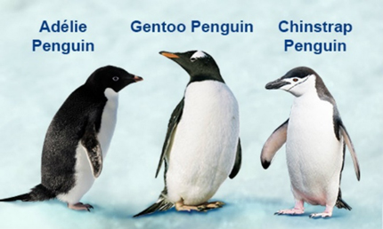
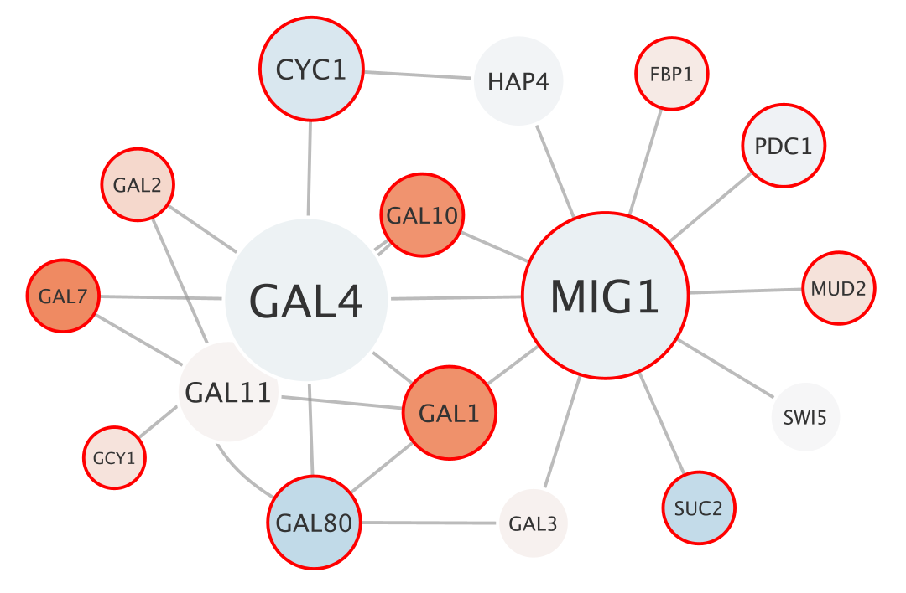
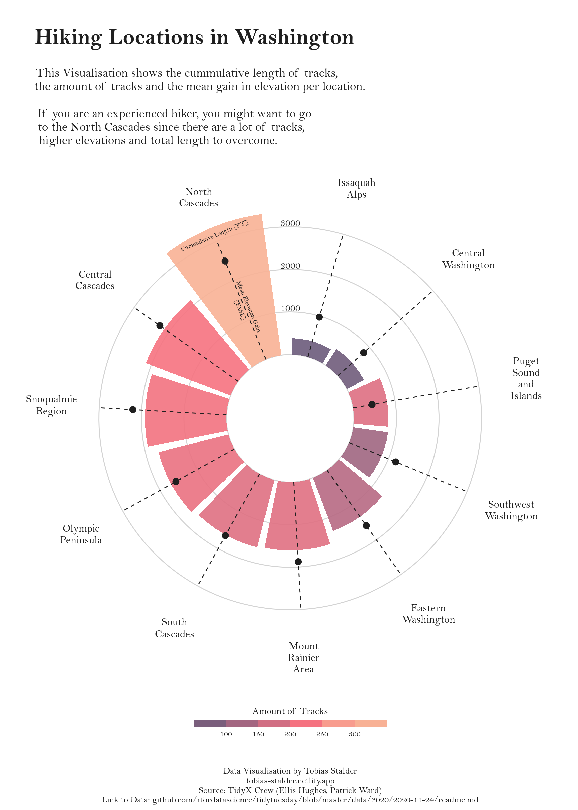
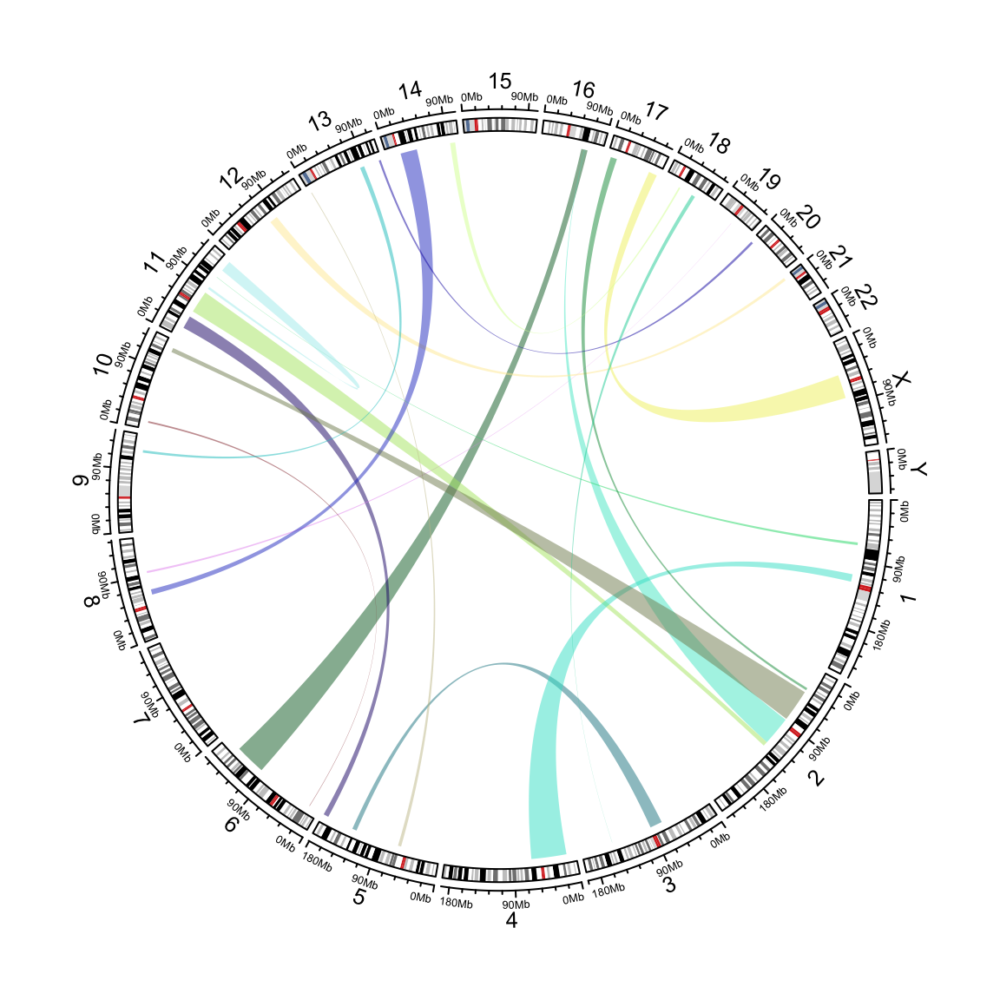
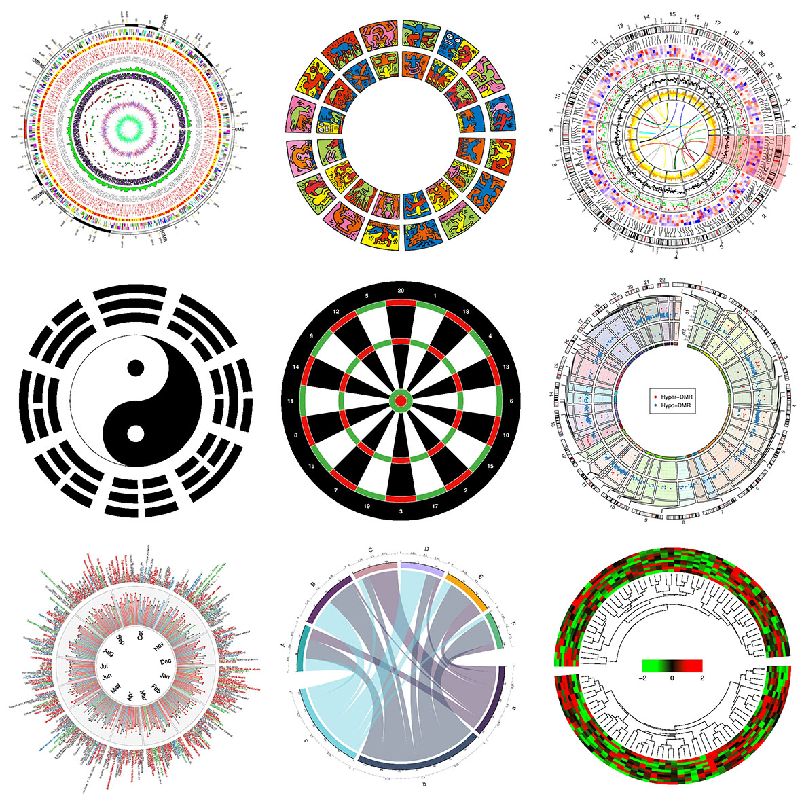

------------------------------------------------------------------------

**Load packages and penguin data**

```{r message = FALSE}
library(tidyverse)
library(palmerpenguins)
library(corrr) ## correlation-based network plots
library(RCy3) ## a Bioconductor package for making Cytoscape network plots
library(circlize) ## circle plots
```



------------------------------------------------------------------------

**Create data frame without missing values**

```{r}
penguins_df <- penguins %>% drop_na()
penguins_df
```

*Note: use caution with `drop_na()`! Make sure you know what this is doing first. Use `?drop_na` to learn more about this function in the Help panel of RStudio. Also look at the original penguins data to find out what you are dropping.*

```{r}
?drop_na
View(penguins)
```

------------------------------------------------------------------------

**Correlation heatmaps revisited**

Before we get into network plots, let's revisit what we learned about pairwise correlations between multiple variables in the Visualizing Multiple Dimensions lesson earlier. Below is the basic correlation matrix plot that we made there.

```{r message = FALSE}
penguins_df %>%
  select(flipper_length_mm, bill_length_mm, bill_depth_mm, body_mass_g) %>%
  correlate() %>%
  autoplot()
```

------------------------------------------------------------------------

## Network Plots

Network plots add to our ability to understand complex relationships visually. There are many different kinds of network plots. I will cover just a few examples.

**Network plot with multidimensional clustering**

We can use network plots to view the same relationships in a different way. As with the correlation matrix plots, we have the direction of correlation indicated by different colors and the strength of correlation indicated by the intensity of the colors.

The network plot below uses multidimensional clustering in addition to help visualize the relationship between all of the variables.

```{r message = FALSE}
?network_plot

penguins_df %>%
  select(flipper_length_mm, bill_length_mm, bill_depth_mm, body_mass_g) %>%
  correlate() %>%
  network_plot(min_cor = 0.1) ## set minimum correlation to display in network
```

What does this tell us that the correlation matrix does not? Since it is using multidimensional clustering of the variables, it is looking at more than two variables at a time (as in the correlation matrix above). The distance between variables and the thickness of the connecting lines (paths) correspond to how strongly variables cluster together.

The pairwise correlations are still represented by the color scale like in the correlation matrix above. For example, we saw that flipper length and body mass have a strong positive Pearson's correlation of $r$= 0.87. This is reflected by the closeness of the variables on this plot, and thickness and intensity of the blue path between them. On the flip side, bill length and depth have a weak negative correlation of $r$= -0.23, so these are far apart and connected by the faint red path. The latter path would disappear entirely if we had left the threshold for minimum correlation (specified by the `min_cor` argument) to the default value of 0.3.

In summary, **network plots** typically**:**

-   Take more than two variables into consideration at once
-   Add spatial representations of variable relationships (the closer the variables appear, the stronger the correlation/clustering)\

Additional information about different types of network plots etc. can be found in the [R Graph Gallery section on network plots](https://r-graph-gallery.com/network.html).

------------------------------------------------------------------------

**Network plots for omics data**

If you are interested in genomics, proteomics, transcriptomics, etc. (omics data), you may want to check out the [`RCy3`](http://cytoscape.org/cytoscape-automation/for-scripters/R/notebooks/basic-data-visualization.nb.html) package from authors of the Gladstone Institute's Cytoscape software is a valuable resource.

{width="610"}

------------------------------------------------------------------------

## **Interaction plots**

Often you want to visualize interactions between variables, e.g. you may want to use an interaction plot. For example, let's say that you want to find out whether bill depth differs by species, and you want to know whether that difference (if any) varies over time. You could do an ANOVA (or linear regression) and then plot the interaction between species and year to visualize this effect.

```{r message = FALSE}
## make sure species and year are both factor variables (for ANOVA interaction)
penguins_df <- penguins_df %>%
  mutate(across(c(species, year), factor))

## run ANVOA to test interaction (assumption: bill depth is normally distributed!)
summary(aov(bill_depth_mm ~ species * year, data = penguins_df))
```

*Note that ANOVA models rely on the assumption that the y variable (bill depth in this case) is continuous and comes from a normal distribution. **Do not** skip over the step of checking this assumption (e.g. using a Q-Q plot)! I did this before running the model.*

It looks like we have a significant interaction between species and year at the p\<0.01 level. You can explain this with the model coefficients, but one of the most useful ways to understand and communicate the nature of the interaction is by plotting the raw means (or predicted means) by group. These plots help you to describe a complex relationship.

```{r message = FALSE}
penguins_df %>%
   group_by(species, year) %>% ## group data by species and year
   summarize(mean_bill_depth = mean(bill_depth_mm)) %>% ## get mean bill depths by group
   ggplot() +
   aes(x = year, y = mean_bill_depth, color = species) +
   geom_line(aes(group = species)) +
   geom_point() +
   labs(x = "Year", y = "Mean Bill Depth", color = "Species") +
   theme_bw()
```

The plot above helps you understand and explain a few important things. Gentoo penguins have increasing bill depths while Adélie penguins have decreasing bill depths. Species are more dissimilar in 2007 compared to 2009, but overall Gentoo penguins have different bill depths.

*Reminder: practical evaluations (e.g., clinical and biological) are different than, but just as important as statistical evaluations. These plots help you with the practical evaluations.*

------------------------------------------------------------------------

## Circular Plots

There are several different types of circular plots, one of which is a circular bar plot (one of the more common types). These come with some caveats ... like with pie charts, you want to make sure you use them when appropriate. This [data-to-viz](https://www.data-to-viz.com/graph/circularbarplot.html) page describes some of the things to be aware of before you use them. They are very handy for visualizing certain types of data, but the code can be complicated. Below I will just show some examples and resources for inspiration without bogging us down with more code.

------------------------------------------------------------------------

**Circular bar plots**

These can be useful when you want to visualize the range of values by categories in a concise way. Here is an example using hiking data in Washington (yes created with ggplot2's `coord_polor()` geometry (the code for the plot below is on the R Graph Gallery website [here](https://r-graph-gallery.com/web-circular-barplot-with-R-and-ggplot2.html)).

{width="571"}

Different bar characteristics represent different features for each region:

-   The color represents the number of hiking trails
-   The height (distance from center of the circle) represents the cumulative length
-   The black dots on the dotted center lines represent the average elevation gain

You can also pretty easily see that the number of trails, trail elevation, and trail length may be correlated, that the Northern Cascades may be significantly higher on all than other areas (you would have to test for statistical significance to find out). And you can see the ranges by region as well. This is a good example of how these plots can help you quickly understand some pretty complex relationships!

------------------------------------------------------------------------

**Circular plots for omics data**

Again, if you are working with genomics data, you may want more sophisticated figures. The [`circlize`](https://jokergoo.github.io/circlize_book/book/index.html) package has more examples, but here is one example of a human genome plot with associated regions (could be expression or mutation levels, etc.) linked in a similar way to the network plot above:

{width="500"}

The circlize package can be used for other applications as well (guess which ones are non-omics plots;).

{width="1000"}

------------------------------------------------------------------------
